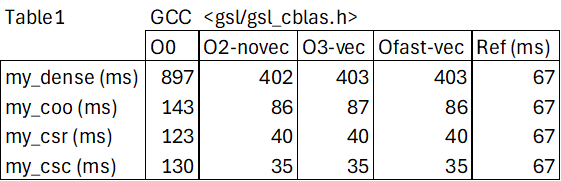

# SpMV: Sparse Matrix-Vector product

Use this code skeleton for the associated tasks in HPCTools.

This code is based on the use of GSL (GNU Scientific Library) for the
implementation of the baseline operations used for comparison:
- dense matrix-vector product: `cblas_dgemv()`, you need to link against *libgslcblas*
- sparse matrix-vector product: `gsl_spblas_dgemv()`, you need to link against *libgsl*

The dense product, cblas_dgemv(), can be found in other CBLAS
implementation. You just need to change the library to be linked,
eg. `-lopenblas` instead of `-lgslcblas`

The basetype in GSL for working with sparse matrices is `gsl_spmatrix`.
GSL also provides functions to help convert you dense matrices into a
sparse format.  

• Ok, you already have your own CSR and dense SpMV functions.
Now, code your COO (triplet) and your CSC versions of SpMV, and
run a benchmark with all 4 implementations.  
• Fill out two tables with the measured execution times obtained
for your 4 kernels when working with 16384 × 16384 matrices
with a 10% non-zero elements, compiled with different
optimizations (see next slide).  
• In the first table, GCC is used for the experiments, while ICC
binaries are employed on the second table.  
• For each compiler, you will compare 4 different versions of your
functions, applying different compiler optimizations (according
to the column names in the tables): no optimization at all, O2
without vectorization, O3 with autovectorization, and Ofast with
autovectorization (use -fast in ICC instead).  
• The last column, Ref, will show the reference time for each
operation, using GSL in Table 1 and Intel MKL in Table 2.

• The following tests were conducted on the finistrae3 system with the configuration compute -c 64 --mem 8:  
    - In the case of the GCC compiler, the flag -novec was replaced with -fno-tree-vectorize.  
    - In the case of the GCC compiler, the flag -vec was replaced with -ftree-vectorize.  

